# TÀI LIỆU CÔNG NGHỆ - HỆ THỐNG CHẤM CÔNG KHUÔN MẶT & XÁC THỰC WIFI NỘI BỘ

## MỤC LỤC

1.  [Kiến trúc hệ thống](#1-kiến-trúc-hệ-thống)
2.  [Stack công nghệ & Thư viện](#2-stack-công-nghệ--thư-viện)
3.  [Cơ sở dữ liệu & Models](#3-cơ-sở-dữ-liệu--models)
4.  [Cơ chế bảo mật kép (WiFi nội bộ + Định vị mạng)](#4-cơ-chế-bảo-mật-kép-wifi-nội-bộ--định-vị-mạng)
5.  [Luồng xử lý chấm công](#5-luồng-xử-lý-chấm-công)
6.  [Chi tiết kỹ thuật AI/ML](#6-chi-tiết-kỹ-thuật-aiml)
7.  [Cấu hình hạ tầng](#7-cấu-hình-hạ-tầng)
8.  [Các kịch bản chống gian lận](#8-các-kịch-bản-chống-gian-lận)

-----

## 1. KIẾN TRÚC HỆ THỐNG

### 1.1. Sơ đồ kiến trúc tổng quan

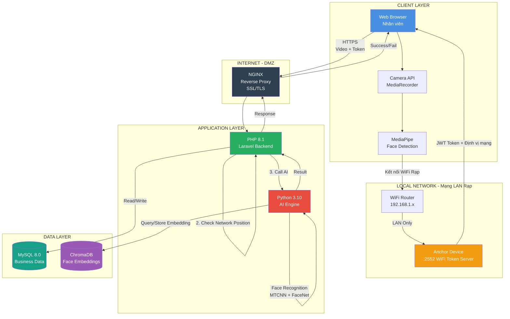

### 1.2. Kiến trúc phân tầng (Layered Architecture)

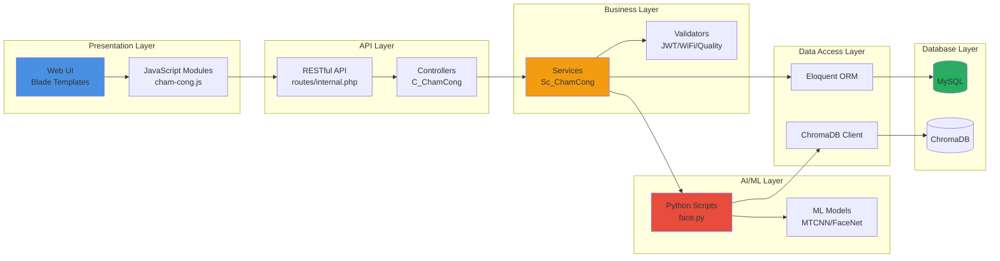

## 2. STACK CÔNG NGHỆ & THƯ VIỆN

### 2.1. Frontend Stack

| Thành phần | Công nghệ | Phiên bản | Mục đích |
|------------|-----------|-----------|----------|
| **Framework UI** | Blade Templates (Laravel) | 10.x | Server-side rendering |
| **CSS Framework** | Tailwind CSS | 3.4.x | Responsive design & styling |
| **JavaScript** | Vanilla ES6+ | - | Client-side logic |
| **Face Detection** | MediaPipe Face Detector | 0.10.0 | Real-time face detection trong browser |
| **Video Recording** | MediaRecorder API | Native HTML5 | Record 3s video WebM |
| **HTTP Client** | Fetch API | Native | API communication |

**Dependencies Frontend:**
```javascript
// CDN Libraries
- @mediapipe/tasks-vision v0.10.0
  → Face detection model (blaze_face_short_range)
  → WASM-based, chạy trên client
- FilesetResolver
  → Load MediaPipe models
```

### 2.2. Backend Stack (PHP)

| Thành phần | Công nghệ | Phiên bản | Vai trò |
|------------|-----------|-----------|---------|
| **Framework** | Laravel | 10.x | MVC framework |
| **Web Server** | NGINX + PHP-FPM | 1.24 + 8.1 | HTTP server |
| **ORM** | Eloquent ORM | 10.x | Database abstraction |
| **JWT Handler** | Custom implementation | - | Token validation (HMAC-SHA256) |
| **Network Position Calculator** | Haversine Formula | - | Distance calculation |

**PHP Libraries:**
```json
{
  "require": {
    "php": "^8.1",
    "laravel/framework": "^10.0",
    "illuminate/database": "^10.0",
    "vlucas/phpdotenv": "^5.5"
  }
}
```

### 2.3. AI/ML Stack (Python)

| Thành phần | Công nghệ | Phiên bản | Chức năng |
|------------|-----------|-----------|-----------|
| **Runtime** | Python | 3.10+ | AI script execution |
| **Computer Vision** | OpenCV (cv2) | 4.8.x | Video processing |
| **Deep Learning** | PyTorch | 2.1.x | Neural network inference |
| **Face Recognition** | facenet-pytorch | 2.5.3 | MTCNN + InceptionResnetV1 |
| **Quality Analysis** | Custom algorithms | - | Brightness/Sharpness/Contrast checks |
| **Vector DB** | ChromaDB | 0.4.x | Face embedding storage |
| **Numeric Computing** | NumPy | 1.24.x | Array operations |

**Python Dependencies:**
```python
# requirements.txt
torch==2.1.0
torchvision==0.16.0
opencv-python==4.8.1.78
facenet-pytorch==2.5.3
chromadb==0.4.18
numpy==1.24.3
Pillow==10.1.0
```

**AI Models Chi Tiết:**

1. **MTCNN (Multi-task Cascaded Convolutional Networks)**
   - **Tác giả**: Zhang et al. (2016)
   - **Mục đích**: Face detection & alignment
   - **Output**: Bounding box + 5 facial landmarks
   - **Size**: ~2MB
   - **Inference time**: ~50ms/frame

2. **InceptionResnetV1 (FaceNet)**
   - **Pretrained on**: VGGFace2 dataset (3.31M images)
   - **Architecture**: Inception + ResNet hybrid
   - **Embedding size**: 512 dimensions
   - **Similarity metric**: Cosine similarity
   - **Threshold**: 0.6 (adjustable)

3. **Quality Analysis (Custom Implementation)**
   - **Metrics**: Brightness, Sharpness (Laplacian variance), Noise (std dev), Contrast (RMS)
   - **Thresholds**:
     - Brightness: 50-230
     - Sharpness: >= 25
     - Noise: <= 100
     - Contrast: >= 10
   - **Purpose**: Đảm bảo chất lượng video đủ tốt cho face recognition

### 2.4. Database Stack

| Database | Loại | Phiên bản | Vai trò |
|----------|------|-----------|---------|
| **MySQL** | Relational DB | 8.0 | Dữ liệu nghiệp vụ |
| **ChromaDB** | Vector DB | 0.4.x | Face embeddings |

### 2.5. Infrastructure Stack

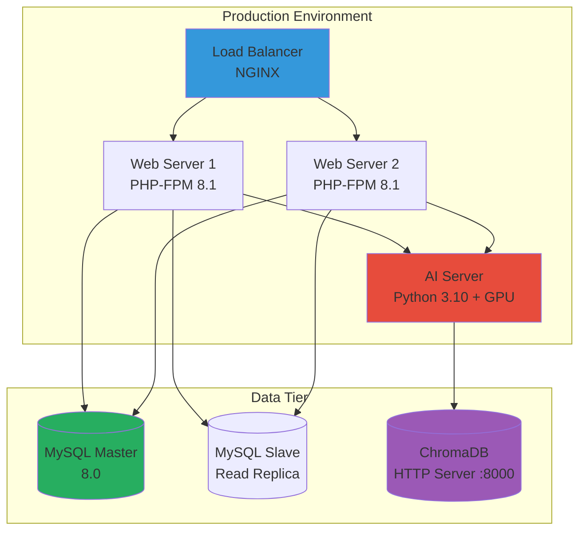

## 3. CƠ SỞ DỮ LIỆU & MODELS

### 3.1. MySQL Schema (Relational Database)

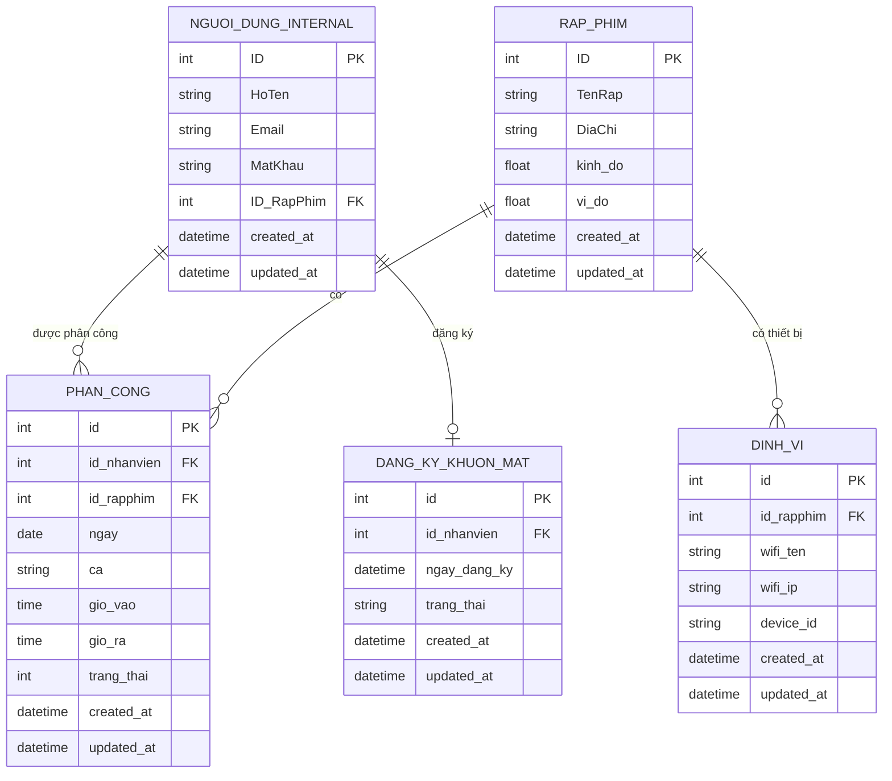

### 3.2. ChromaDB Collections (Vector Database)

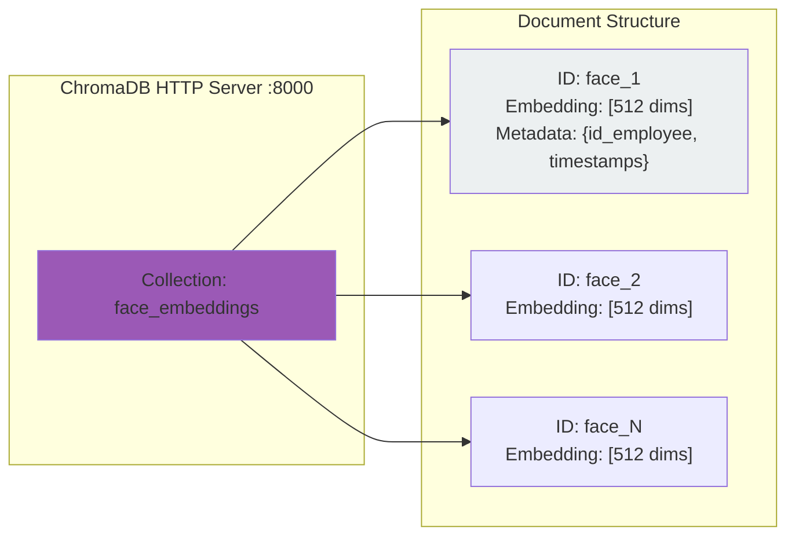

**ChromaDB Collection Config:**
```python
collection = client.get_or_create_collection(
    name="face_embeddings",
    metadata={"hnsw:space": "cosine"}  # Cosine similarity
)

# Document format:
{
    "id": "face_123",
    "embedding": [0.123, -0.456, ...],  # 512 float values
    "metadata": {
        "id_employee": "123",
        "created_at": "2025-12-06T10:30:00",
        "updated_at": "2025-12-06T10:30:00"
    }
}
```

### 3.3. Laravel Models (Eloquent ORM)

```php
// app/Models/PhanCong.php
class PhanCong extends Model {
    protected $table = 'phan_cong';
    protected $fillable = [
        'id_nhanvien', 'id_rapphim', 'ngay', 'ca',
        'gio_vao', 'gio_ra', 'trang_thai'
    ];
    
    // Relationships
    public function nhanVien() {
        return $this->belongsTo(NguoiDungInternal::class, 'id_nhanvien');
    }
    
    public function rapPhim() {
        return $this->belongsTo(RapPhim::class, 'id_rapphim');
    }
}

// app/Models/DangKyKhuonMat.php
class DangKyKhuonMat extends Model {
    protected $table = 'dang_ky_khuon_mat';
    protected $fillable = ['id_nhanvien', 'ngay_dang_ky', 'trang_thai'];
    
    const TRANG_THAI_HOAT_DONG = 'Đang hoạt động';
    const TRANG_THAI_VO_HIEU = 'Vô hiệu hóa';
}

// app/Models/RapPhim.php
class RapPhim extends Model {
    protected $table = 'rap_phim';
    protected $fillable = ['TenRap', 'DiaChi', 'kinh_do', 'vi_do'];
    
    public function dinhVi() {
        return $this->hasOne(DinhVi::class, 'id_rapphim');
    }
}
```

### 3.4. Data Flow Diagram

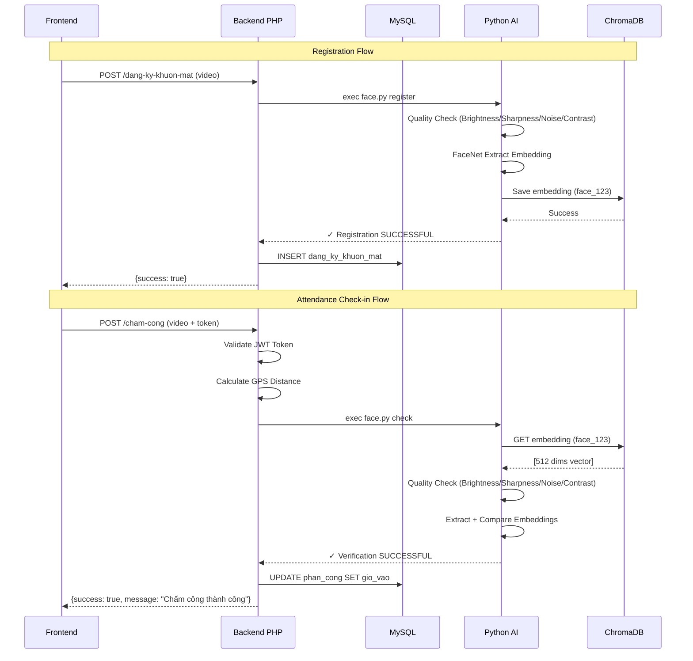

## 4. CƠ CHẾ BẢO MẬT KÉP (WIFI + GPS)

### 1.1. Mô tả chức năng

Hệ thống chấm công là giải pháp xác thực danh tính kết hợp với **chứng thực hạ tầng mạng**. Hệ thống yêu cầu nhân viên phải có mặt thực tế tại rạp và kết nối vào hệ thống mạng nội bộ (LAN) của rạp để thực hiện chấm công.

Cốt lõi của giải pháp bao gồm:

1.  **Xác thực hạ tầng mạng (Primary Check)**: Nhân viên phải kết nối đúng WiFi của rạp để có thể giao tiếp với **Máy chủ xác thực WiFi cục bộ (Local Anchor Device)** qua mạng LAN.
2.  **Nhận diện khuôn mặt (Identity Check)**: Sử dụng AI để đảm bảo chính chủ.
3.  **Xác thực vị trí mạng (Secondary Check)**: Sử dụng tọa độ địa lý được ký số (JWT) từ máy chủ cục bộ để chống giả mạo điểm phát sóng WiFi.

### 1.2. Quy trình tóm tắt

Nhân viên mở web chấm công -\> Hệ thống tự động kết nối tới IP Local của Rạp (ví dụ: `192.168.1.200:2552`) -\> Nếu kết nối thành công, lấy Token chứa tọa độ -\> Gửi Token + Video khuôn mặt lên Server -\> Server xác thực.

-----

## 2\. CƠ CHẾ BẢO MẬT KÉP (WIFI NỘI BỘ + ĐỊNH VỊ MẠNG)

Đây là điểm khác biệt quan trọng của hệ thống. Chúng tôi không sử dụng vị trí GPS của điện thoại nhân viên (vốn dễ bị fake), mà sử dụng **tọa độ địa lý của thiết bị cố định tại rạp** được nhúng trong JWT token để xác thực mạng WiFi.

### Tại sao cần kết hợp cả WiFi nội bộ và định vị mạng?

Nếu chỉ xác thực tên WiFi (SSID) và IP Local, hệ thống sẽ gặp các rủi ro bảo mật sau. Cơ chế định vị mạng trong JWT sinh ra để giải quyết triệt để các trường hợp này:

| Rủi ro gian lận | Mô tả kịch bản tấn công | Cơ chế ngăn chặn (Vai trò của định vị mạng/JWT) |
| :--- | :--- | :--- |
| **1. Trùng lặp hạ tầng** | 2 rạp phim khác nhau (Rạp A và Rạp B) vô tình đặt trùng tên WiFi (VD: `Cinema_Staff`) và trùng dải IP Local (`192.168.1.100`). Nhân viên ở Rạp A có thể chấm công cho Rạp B. | **Kiểm tra tọa độ**: Token từ thiết bị tại Rạp A sẽ chứa tọa độ A. Khi gửi lên chấm công cho Rạp B, hệ thống thấy tọa độ không khớp với Rạp B -\> **Chặn**. |
| **2. Giả mạo điểm phát sóng (Evil Twin)** | Nhân viên dùng điện thoại phát 4G (Hotspot) đặt tên WiFi là `Cinema_Staff` và thiết lập IP tĩnh để giả lập mạng rạp. | **Không thể lấy Token**: Dù nhân viên tạo được mạng WiFi giả, họ **không có "Thiết bị định vị cố định"** đang chạy port 2552 trong mạng giả đó. Web chấm công sẽ không thể kết nối tới `192.168.x.x:2552` để lấy token -\> **Chặn**. |
| **3. Giả lập Server Local** | Nhân viên cao tay tự dựng một server ảo trên laptop cá nhân, mở port 2552 để giả làm thiết bị rạp. | **Không có Secret Key**: Token định vị được ký bằng `HMAC-SHA256` với khóa bí mật (`WIFI_SECRET_KEY`) chỉ thiết bị thật của rạp mới có. Server giả không thể tạo ra token hợp lệ -\> **Chặn**. |

-----

## 5. LUỒNG XỬ LÝ CHẤM CÔNG

### 5.1. Sơ đồ luồng dữ liệu tổng quan

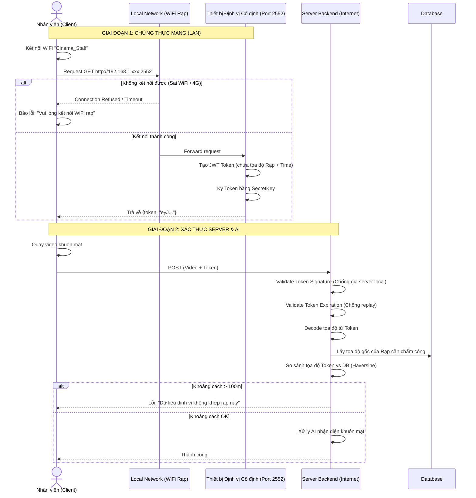

### 5.2. Luồng xử lý chi tiết (Step by Step)

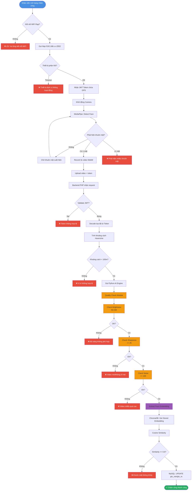

-----

## 6. CHI TIẾT KỸ THUẬT AI/ML

### 6.1. Pipeline xử lý video (Python)

```mermaid
graph LR
    subgraph "Video Input"
        VID[video.webm<br/>3 seconds<br/>1280x720]
    end
    
    subgraph "Quality Analysis"
        Q1[Frame Sampling<br/>Every 5th frame]
        Q2[Brightness Check<br/>50-230]
        Q3[Sharpness Check<br/>Laplacian >= 25]
        Q4[Noise Check<br/>StdDev <= 100]
        Q5[Contrast Check<br/>>= 10]
    end
    
    subgraph "Face Recognition"
        FR1[MTCNN Detect & Align]
        FR2[Resize to 160x160]
        FR3[InceptionResnetV1]
        FR4[512-dim Embedding]
        FR5[L2 Normalization]
        FR6[Average Embeddings]
    end
    
    subgraph "Verification"
        V1[Get Stored Embedding<br/>from ChromaDB]
        V2[Cosine Similarity]
        V3[Threshold 0.6]
    end
    
    VID --> Q1 --> Q2 --> Q3 --> Q4 --> Q5
    Q5 --> FR1 --> FR2 --> FR3 --> FR4 --> FR5 --> FR6
    FR6 --> V1 --> V2 --> V3
    
    style VID fill:#3498db
    style Q5 fill:#f39c12
    style FR3 fill:#9b59b6
    style V2 fill:#27ae60
```

### 6.2. Quality Analysis Implementation

```python
# Cấu trúc Quality Check từ face.py
def analyze_quality(frame):
    """
    Tính các metric chất lượng ảnh:
    - brightness: độ sáng trung bình
    - sharpness: variance of Laplacian
    - noise: độ lệch chuẩn
    - contrast: RMS contrast (std)
    """
    gray = cv2.cvtColor(frame, cv2.COLOR_BGR2GRAY)
    
    brightness = np.mean(gray)
    sharpness = cv2.Laplacian(gray, cv2.CV_64F).var()
    noise = np.std(gray)
    contrast = gray.std()
    
    return brightness, sharpness, noise, contrast

def check_quality(video_path):
    # Ngưỡng đánh giá
    BRIGHTNESS_MIN = 50
    BRIGHTNESS_MAX = 230
    SHARPNESS_MIN = 25
    NOISE_MAX = 100
    CONTRAST_MIN = 10
    
    # Xử lý 10 frames và tính trung bình
    # Kiểm tra đạt chuẩn
    if (BRIGHTNESS_MIN <= avg_brightness <= BRIGHTNESS_MAX and
            avg_sharpness >= SHARPNESS_MIN and
            avg_noise <= NOISE_MAX and
            avg_contrast >= CONTRAST_MIN):
        return True
    return False
```

### 6.3. Quality Check Logic

```python
# Code thực tế từ face.py
def analyze_quality(frame):
    """
    Tính các metric chất lượng ảnh:
    - brightness: độ sáng trung bình
    - sharpness: variance of Laplacian
    - noise: độ lệch chuẩn
    - contrast: RMS contrast (std)
    """
    gray = cv2.cvtColor(frame, cv2.COLOR_BGR2GRAY)
    
    brightness = np.mean(gray)
    sharpness = cv2.Laplacian(gray, cv2.CV_64F).var()
    noise = np.std(gray)
    contrast = gray.std()
    
    return brightness, sharpness, noise, contrast

def check_quality(video_path):
    # Ngưỡng đánh giá
    BRIGHTNESS_MIN = 50
    BRIGHTNESS_MAX = 230
    SHARPNESS_MIN = 25
    NOISE_MAX = 100
    CONTRAST_MIN = 10
    
    # Xử lý 10 frames và tính trung bình
    cap = cv2.VideoCapture(video_path)
    results = []
    frame_count = 0
    max_frames = 10
    
    while True:
        ret, frame = cap.read()
        if not ret or frame_count >= max_frames:
            break
        
        brightness, sharpness, noise, contrast = analyze_quality(frame)
        results.append((brightness, sharpness, noise, contrast))
        frame_count += 1
    
    cap.release()
    
    avg_brightness = np.mean([r[0] for r in results])
    avg_sharpness = np.mean([r[1] for r in results])
    avg_noise = np.mean([r[2] for r in results])
    avg_contrast = np.mean([r[3] for r in results])
    
    # Kiểm tra đạt chuẩn
    if (BRIGHTNESS_MIN <= avg_brightness <= BRIGHTNESS_MAX and
            avg_sharpness >= SHARPNESS_MIN and
            avg_noise <= NOISE_MAX and
            avg_contrast >= CONTRAST_MIN):
        return True
    return False
```

### 6.4. Face Recognition Workflow

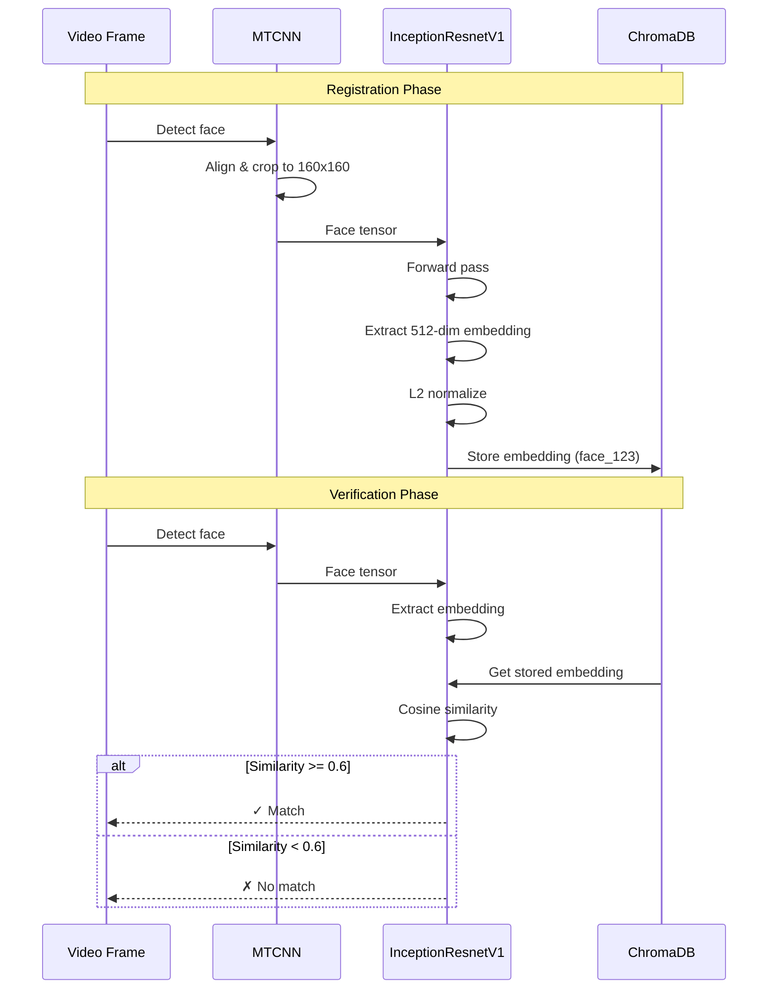

-----

## 7. CẤU HÌNH HẠ TẦNG

### 7.1. Network Topology

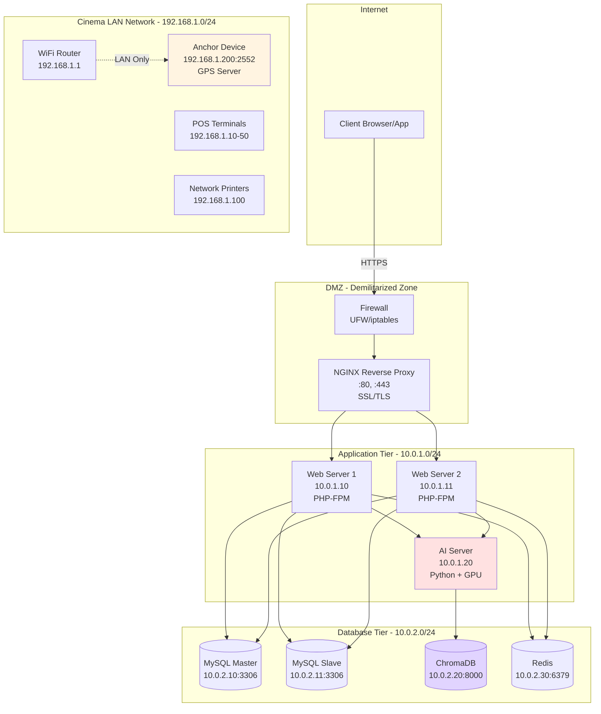

### 7.2. Anchor Device Configuration

**Hardware Specification:**
```yaml
Anchor Device (WiFi Token Server):
  Type: Raspberry Pi 4B / Mini PC / Android Device
  CPU: ARM Cortex-A72 / x86_64
  RAM: 2GB minimum
  Storage: 16GB SD Card
  Network: Ethernet 1Gbps (preferred) or WiFi
  Location Module: Hardcoded coordinates (hoặc GPS module tùy chọn)
  Power: 5V/3A USB-C (UPS backup recommended)
```

**Software Stack:**
```yaml
OS: Raspbian Lite / Ubuntu Server 22.04
Runtime: Node.js 18.x / Python 3.10
Location Config: Hardcoded trong file config (hoặc gpsd nếu dùng GPS module)
HTTP Server: Express.js / FastAPI
Port: 2552
Startup: systemd service (auto-start on boot)
```

**Server Code Example (Node.js):**
```javascript
// server.js - WiFi Token Server
const express = require('express');
const jwt = require('jsonwebtoken');

const app = express();
const SECRET_KEY = process.env.WIFI_SECRET_KEY;

// Tọa độ địa lý của rạp (hardcoded trong config)
const CINEMA_LAT = 10.762622;
const CINEMA_LNG = 106.660172;

app.get('/', (req, res) => {
    const payload = {
        device_id: 'CINEMA_A_DEVICE_01',
        latitude: CINEMA_LAT,
        longitude: CINEMA_LNG,
        timestamp: Math.floor(Date.now() / 1000),
        exp: Math.floor(Date.now() / 1000) + 30  // 30s expiry
    };
    
    const token = jwt.sign(payload, SECRET_KEY, { algorithm: 'HS256' });
    
    res.json({
        status: 'success',
        token: token,
        google_maps_url: `https://maps.google.com/?q=${CINEMA_LAT},${CINEMA_LNG}`
    });
});

app.listen(2552, '0.0.0.0', () => {
    console.log('GPS Token Server running on port 2552');
});
```

### 7.3. Server Requirements

**Web Server (PHP-FPM):**
```ini
; /etc/php/8.1/fpm/pool.d/www.conf
pm = dynamic
pm.max_children = 50
pm.start_servers = 10
pm.min_spare_servers = 5
pm.max_spare_servers = 20
pm.max_requests = 500
request_terminate_timeout = 120s

; PHP ini settings
upload_max_filesize = 50M
post_max_size = 50M
max_execution_time = 120
memory_limit = 512M
```

**AI Server (Python):**
```yaml
Hardware:
  CPU: Intel Xeon / AMD EPYC 8+ cores
  RAM: 16GB minimum, 32GB recommended
  GPU: NVIDIA RTX 3060 / Tesla T4 (optional but recommended)
  Storage: 100GB SSD
  
Software:
  OS: Ubuntu 22.04 LTS
  Python: 3.10+
  CUDA: 11.8 (if GPU enabled)
  cuDNN: 8.6
  
Python Environment:
  Virtual Env: /var/www/epiccinema.code/venv
  Requirements: requirements.txt
  Models Path: bin/python/anti_spoof_models/
```

### 7.4. NGINX Configuration

```nginx
# /etc/nginx/sites-available/epiccinema
upstream php_backend {
    server 10.0.1.10:9000;
    server 10.0.1.11:9000;
    keepalive 32;
}

server {
    listen 80;
    server_name cinema.example.com;
    return 301 https://$server_name$request_uri;
}

server {
    listen 443 ssl http2;
    server_name cinema.example.com;
    
    ssl_certificate /etc/ssl/certs/cinema.crt;
    ssl_certificate_key /etc/ssl/private/cinema.key;
    ssl_protocols TLSv1.2 TLSv1.3;
    ssl_ciphers HIGH:!aNULL:!MD5;
    
    root /var/www/epiccinema.code/public;
    index index.php index.html;
    
    client_max_body_size 50M;
    
    location / {
        try_files $uri $uri/ /index.php?$query_string;
    }
    
    location ~ \.php$ {
        fastcgi_pass php_backend;
        fastcgi_index index.php;
        fastcgi_param SCRIPT_FILENAME $document_root$fastcgi_script_name;
        include fastcgi_params;
        fastcgi_read_timeout 120s;
    }
    
    location /api/cham-cong/ {
        fastcgi_pass php_backend;
        fastcgi_read_timeout 180s;  # AI processing can take longer
        include fastcgi_params;
    }
}
```

-----

## 8. CÁC KỊCH BẢN CHỐNG GIAN LẬN

### 4.1. Thiết bị xác thực WiFi cố định (Anchor Device)

Đây là thành phần quan trọng nhất để chứng minh nhân viên đang ở tại rạp.

  * **Vai trò**: Là một máy tính nhỏ/điện thoại/IoT device nằm cố định tại rạp, luôn chạy 24/7.
  * **Mạng**: Có địa chỉ IP Tĩnh trong mạng LAN (Ví dụ: `192.168.1.200`).
  * **Phần mềm**: Chạy một HTTP Server lắng nghe ở cổng **2552**.
  * **Bảo mật**: Chứa `WIFI_SECRET_KEY` được hardcode hoặc cấu hình bảo mật.

### 4.2. Giao thức xác thực LAN

Khi nhân viên truy cập trang web chấm công, Browser sẽ thực hiện lệnh `fetch` tới IP nội bộ:

```javascript
// Frontend Code Logic
async function getProofOfPresence() {
    // IP này được cấu hình theo từng rạp trong Database
    const localDeviceIp = document.getElementById('camera-section').dataset.ip; 
    
    try {
        // Cố gắng giao tiếp với thiết bị trong mạng LAN
        // Nếu dùng 4G hoặc WiFi nhà, request này sẽ chết (Timeout/Unreachable)
        const response = await fetch(`http://${localDeviceIp}:2552/get-token`, {
            timeout: 5000 // Timeout ngắn 5s
        });
        
        return await response.json(); // Trả về JWT
    } catch (e) {
        throw new Error("Không tìm thấy thiết bị chấm công. Vui lòng kiểm tra kết nối WiFi Rạp.");
    }
}
```

### 4.3. Cấu trúc JWT Token

Token này chứng minh: "Tôi đã nói chuyện được với thiết bị xịn của rạp lúc [Timestamp] tại tọa độ [Location]".

```json
{
  "alg": "HS256",
  "typ": "JWT"
}
.
{
  "device_id": "RAP_A_DEVICE_01",
  "lat": 10.762622,   // Tọa độ CỨNG của thiết bị tại rạp
  "lng": 106.660172,
  "timestamp": 1705123456, // Thời gian tạo token
  "exp": 1705123486   // Hết hạn sau 30 giây (Chống dùng lại)
}
.
[SIGNATURE] // Ký bằng WIFI_SECRET_KEY
```

-----

## 5\. HƯỚNG DẪN CẤU HÌNH CHO KỸ THUẬT VIÊN

Để hệ thống hoạt động chính xác và tránh xung đột, kỹ thuật viên cần tuân thủ:

### 5.1. Cấu hình Thiết bị định vị (Anchor Device)

1.  **IP Tĩnh**: Bắt buộc set IP tĩnh cho thiết bị (VD: `192.168.1.250`) để tránh DHCP đổi IP làm web không gọi được.
2.  **Cổng**: Đảm bảo Firewall của mạng Wifi Rạp cho phép giao tiếp nội bộ qua port `2552`.

### 5.2. Cấu hình trên CMS (Web Quản trị)

Khi khai báo một Rạp mới, cần điền chính xác:

1.  **IP Local**: IP của thiết bị định vị (để Frontend gọi).
2.  **Tên WiFi**: Để hiển thị hướng dẫn cho nhân viên (VD: "Vui lòng kết nối wifi: Cinema\_Guest").
3.  **Tọa độ (Lat/Long)**: Tọa độ thực tế của rạp (Dùng để đối chiếu với tọa độ trong Token gửi lên).

### 5.3. Xử lý lỗi thường gặp (Troubleshooting)

**Lỗi: "Không thể kết nối tới Server xác thực WiFi"**

  * *Nguyên nhân 1*: Nhân viên đang dùng 4G hoặc WiFi quán cafe bên cạnh. -\> **Yêu cầu kết nối đúng WiFi rạp**.
  * *Nguyên nhân 2*: Thiết bị xác thực tại rạp bị tắt nguồn hoặc mất kết nối mạng.
  * *Nguyên nhân 3*: Nhân viên dùng iPhone bật tính năng "Private Wi-Fi Address" hoặc VPN chặn truy cập LAN.

**Lỗi: "Dữ liệu vị trí không hợp lệ (Khoảng cách xa)"**

  * *Nguyên nhân*: Có 2 rạp (Rạp A và Rạp B) dùng chung dải mạng `192.168.1.x` và nhân viên Rạp A đang cố chấm công vào ca của Rạp B. Web Rạp B gọi nhầm vào thiết bị Rạp A (do trùng IP). Server phát hiện tọa độ thiết bị A không khớp với Rạp B -\> Chặn.

### 8.5. Monitoring & Logging

**Log Files Structure:**
```
cache/log/
├── face_checkin.log      # Check-in AI logs
├── face_checkout.log     # Check-out AI logs
├── face_register.log     # Registration logs
├── nginx_access.log      # NGINX access logs
├── nginx_error.log       # NGINX error logs
├── php_errors.log        # PHP application errors
└── chromadb.log          # Vector database logs
```

**Metrics to Monitor:**
- Anchor Device uptime & response time
- AI inference latency (should be < 3s)
- ChromaDB query performance
- MySQL connection pool usage
- Failed authentication attempts
- Network position violations
- Quality check pass rate

-----

## 9. DEPLOYMENT & MAINTENANCE

### 9.1. Deployment Checklist


**Step-by-step:**
```bash
# 1. Clone repository
git clone https://github.com/your-org/epiccinema.git
cd epiccinema.code

# 2. PHP dependencies
composer install --no-dev --optimize-autoloader

# 3. Python dependencies
python3 -m venv venv
source venv/bin/activate
pip install -r requirements.txt

# 4. Database setup
php artisan migrate --force

# 6. Start ChromaDB
docker run -d -p 8000:8000 chromadb/chroma:latest

# 7. Setup systemd services
sudo systemctl enable nginx php8.1-fpm
sudo systemctl start nginx php8.1-fpm
```

### 9.2. Backup Strategy

```yaml
Daily Backups:
  MySQL:
    Type: Full dump
    Schedule: 2:00 AM daily
    Retention: 7 days
    Command: mysqldump --all-databases | gzip > backup_$(date +%Y%m%d).sql.gz
    
  ChromaDB:
    Type: Collection export
    Schedule: 2:30 AM daily
    Retention: 30 days
```

### 9.3. Troubleshooting Guide

| Vấn đề | Nguyên nhân khả dĩ | Giải pháp |
|--------|-------------------|-----------|
| Không kết nối được Anchor Device | - Thiết bị tắt<br/>- Sai WiFi<br/>- Port 2552 bị chặn | - Kiểm tra nguồn điện<br/>- Xác nhận kết nối WiFi nội bộ<br/>- Mở firewall port 2552 |
| AI xử lý quá chậm | - GPU không được sử dụng<br/>- Model chưa cache | - Cài PyTorch với CUDA<br/>- Warm-up model khi start |
| ChromaDB connection refused | - Service chưa chạy<br/>- Port 8000 conflict | - `docker ps` kiểm tra container<br/>- Đổi port nếu conflict |
| Face không khớp dù đúng người | - Threshold quá cao<br/>- Ánh sáng thay đổi nhiều | - Giảm threshold về 0.55<br/>- Đăng ký lại trong điều kiện tương tự |
| Quality check luôn fail | - Ánh sáng quá tối/quá sáng<br/>- Camera mờ | - Cải thiện ánh sáng (50-230)<br/>- Lau lens camera<br/>- Giảm ngưỡng sharpness |

-----

## 10. KẾT LUẬN

### 10.1. Điểm mạnh của hệ thống

✅ **Bảo mật đa lớp:**
- Xác thực mạng LAN (WiFi nội bộ)
- Định vị mạng chống giả mạo WiFi
- JWT token với HMAC-SHA256
- Quality analysis (brightness, sharpness, noise, contrast)
- Face recognition với cosine similarity

✅ **Độ chính xác cao:**
- FaceNet pretrained trên 3.31M images
- Threshold tùy chỉnh (0.6 default)
- Multi-metric quality validation

✅ **Scalable Architecture:**
- Load balancer hỗ trợ multiple web servers
- ChromaDB vector search nhanh
- MySQL replication cho read-heavy workload

### 10.2. Roadmap phát triển

**Q1 2026:**
- [ ] Thêm face mask detection
- [ ] Mobile app native (React Native)
- [ ] Real-time dashboard monitoring

**Q2 2026:**
- [ ] Multi-factor authentication (OTP)
- [ ] Behavioral biometrics (typing pattern)
- [ ] Edge AI deployment (on-device inference)

**Q3 2026:**
- [ ] Blockchain audit trail
- [ ] Federated learning cho privacy
- [ ] Kubernetes deployment

-----

*Tài liệu này cung cấp cái nhìn toàn diện về kiến trúc, công nghệ và triển khai hệ thống chấm công AI. Mọi thay đổi về infrastructure hoặc algorithm cần cập nhật vào tài liệu này.*

**Phiên bản tài liệu:** 2.0  
**Cập nhật lần cuối:** 2025-12-06  
**Tác giả:** Development Team - EPIC Cinema  
**Liên hệ:** tech@epiccinema.com