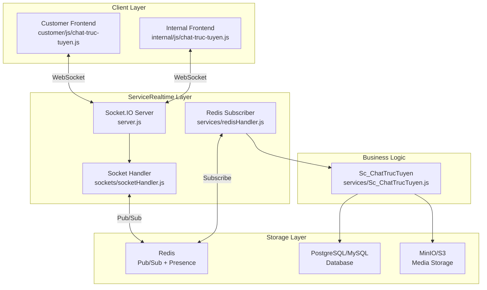
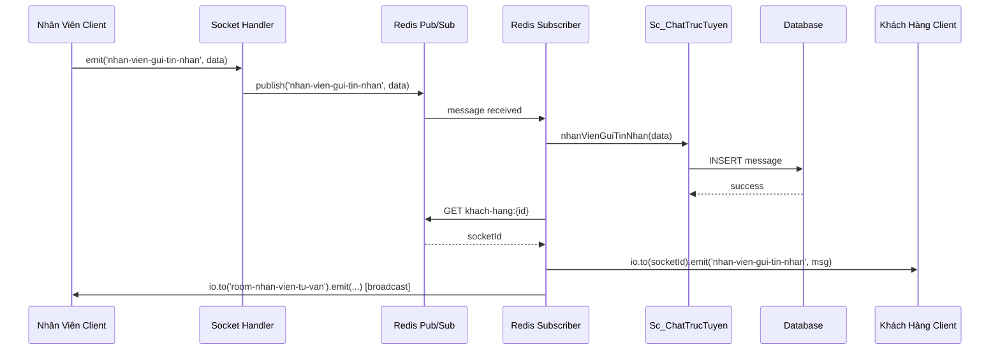
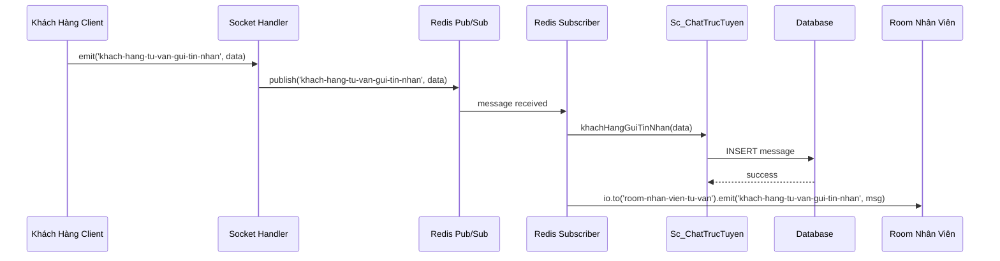

# Tài Liệu Kỹ Thuật - Hệ Thống Chat Trực Tuyến

> **Phiên bản:** 1.0  
> **Cập nhật:** December 2025  
> **Mục đích:** Mô tả chi tiết kiến trúc và luồng hoạt động của hệ thống chat realtime

---

## 📋 Mục Lục

1. [Tổng Quan Kiến Trúc](#1-tổng-quan-kiến-trúc)
2. [Socket Events](#2-socket-events)
3. [Redis Keys & Patterns](#3-redis-keys--patterns)
4. [Luồng Xử Lý Chi Tiết](#4-luồng-xử-lý-chi-tiết)
5. [Payload Format](#5-payload-format)
6. [Cấu Trúc Code](#6-cấu-trúc-code)
7. [Frontend Integration](#7-frontend-integration)
8. [Cấu Hình & Deployment](#8-cấu-hình--deployment)
9. [Testing & Debugging](#9-testing--debugging)
10. [So Sánh Giải Pháp](#10-so-sánh-giải-pháp)
11. [Tối Ưu & Mở Rộng](#11-tối-ưu--mở-rộng)

---

## 1. Tổng Quan Kiến Trúc

### 1.1 Sơ Đồ Hệ Thống



### 1.2 Thành Phần Chính

| Thành Phần | Vai Trò | File |
|------------|---------|------|
| **Socket.IO Server** | Quản lý WebSocket connections | `ServiceRealtime/server.js` |
| **Socket Handler** | Xử lý events, presence tracking | `sockets/socketHandler.js` |
| **Redis Subscriber** | Lắng nghe pub/sub, emit tới clients | `services/redisHandler.js` |
| **Chat Service** | Business logic, lưu DB | `services/Sc_ChatTrucTuyen.js` |
| **Redis** | Pub/Sub messaging, presence cache | External service |
| **Database** | Persistent storage cho messages | External DB |
| **MinIO** | Media file storage | External service |

---

## 2. Socket Events

### 2.1 Client → Server Events

#### Khách Hàng (Customer)

| Event | Payload | Mô Tả |
|-------|---------|-------|
| `khach-hang-truc-tuyen` | `String: id_khachhang` | Đánh dấu khách hàng online |
| `khach-hang-gui-tin-nhan` | `JSON String` | Gửi tin nhắn nhanh |
| `khach-hang-tu-van-gui-tin-nhan` | `JSON String/Object` | Gửi tin nhắn tư vấn (hỗ trợ ảnh) |
| `khach-hang-mo-phien-chat` | `{id, id_khachhang}` | Mở phiên chat mới |
| `khach-hang-dong-phien-chat` | `{id, id_khachhang}` | Đóng phiên chat |

#### Nhân Viên (Staff)

| Event | Payload | Mô Tả |
|-------|---------|-------|
| `nhan-vien-tham-gia-tu-van` | `{id}` | Đăng ký online, join room |
| `nhan-vien-gui-tin-nhan` | `JSON String/Object` | Gửi tin nhắn tới khách hàng |

### 2.2 Server → Client Events

| Event | Target | Mô Tả |
|-------|--------|-------|
| `khach-hang-tu-van-gui-tin-nhan` | `room-nhan-vien-tu-van` | Broadcast tin nhắn từ khách tới nhân viên |
| `nhan-vien-gui-tin-nhan` | Specific socket / room | Gửi tin nhắn từ nhân viên tới khách |

### 2.3 Redis Pub/Sub Channels

```
Channels được sử dụng:
├── khach-hang-gui-tin-nhan
├── khach-hang-tu-van-gui-tin-nhan
├── khach-hang-tao-phien-chat
├── khach-hang-mo-phien-chat
├── nhan-vien-gui-tin-nhan
├── nhan-vien-mo-phien-chat
├── lichgoivideo:moi
├── lichgoivideo:dachon
├── lichgoivideo:huy
├── khach-hang-chon-ghe
└── khach-hang-huy-chon-ghe
```

---

## 3. Redis Keys & Patterns

### 3.1 Presence Tracking

| Key Pattern | Value | Mục Đích |
|-------------|-------|----------|
| `khach-hang:{id}` | `socketId` | Map khách hàng → socket |
| `socket-khach-hang:{socketId}` | `id_khachhang` | Reverse lookup khi disconnect |
| `nhan-vien:{id}` | `socketId` | Map nhân viên → socket |
| `socket-nhan-vien:{socketId}` | `id_nhanvien` | Reverse lookup nhân viên |

### 3.2 Session Tracking

| Key Pattern | Value | Mục Đích |
|-------------|-------|----------|
| `khach-hang-{id}-mo-phien-chat` | `id_phienchat` | Phiên chat đang mở của khách |
| `nhan-vien-{id}-mo-phien-chat` | `id_phienchat` | Phiên chat đang mở của nhân viên |
| `list-phien-chat-khach-hang-mo` | `Set of ids` | Danh sách các phiên đang mở |
| `list-phien-chat-nhan-vien-mo` | `Set of ids` | Danh sách phiên nhân viên đang xử lý |

### 3.3 Ví Dụ Redis Commands

```bash
# Lưu khách hàng online
SET khach-hang:123 "socket_abc123"
SET socket-khach-hang:socket_abc123 "123"

# Lưu phiên chat
SET khach-hang-123-mo-phien-chat "phien-456"
SADD list-phien-chat-khach-hang-mo "phien-456"

# Xóa khi disconnect
DEL khach-hang:123
DEL socket-khach-hang:socket_abc123
```

---

## 4. Luồng Xử Lý Chi Tiết

### 4.1 Luồng: Nhân Viên → Khách Hàng



**Các Bước:**

1. **Client emit:** Nhân viên gửi event `nhan-vien-gui-tin-nhan` với payload JSON
2. **Publish:** Socket handler publish message lên Redis channel
3. **Subscribe:** Redis subscriber nhận message
4. **Save DB:** Gọi `Sc_ChatTrucTuyen.nhanVienGuiTinNhan()` để lưu vào database
5. **Lookup:** Lấy socketId của khách hàng từ Redis
6. **Emit:** Gửi message trực tiếp tới socket khách hàng
7. **Broadcast:** Đồng thời broadcast tới room nhân viên (trừ người gửi)

### 4.2 Luồng: Khách Hàng → Nhân Viên



**Các Bước:**

1. Khách hàng emit event với payload
2. Socket handler publish lên Redis
3. Subscriber nhận và lưu DB
4. Emit tới toàn bộ room nhân viên đang online

---

## 5. Payload Format

### 5.1 Nhân Viên Gửi Tin Nhắn (Text)

```json
{
  "id_phienchat": "phien-123",
  "id_nhanvien": 45,
  "id_khachhang": 789,
  "noi_dung": "Xin chào, anh/chị cần hỗ trợ gì?",
  "loai_noi_dung": 1
}
```

**Lưu ý:** Hỗ trợ cả `snake_case` và `camelCase`:
- `id_phienchat` ↔ `idPhienChat`
- `id_nhanvien` ↔ `idNhanVien`
- `noi_dung` ↔ `noiDung`

### 5.2 Gửi Tin Nhắn Kèm Ảnh

```json
{
  "id_phienchat": "phien-123",
  "id_nhanvien": 45,
  "id_khachhang": 789,
  "loai_noi_dung": 2,
  "image_data": "data:image/jpeg;base64,/9j/4AAQSkZJRg...",
  "file_name": "photo.jpg",
  "file_type": "image/jpeg"
}
```

### 5.3 Message Từ Server → Client

```json
{
  "id": "phien-123",
  "msg": "Nội dung tin nhắn",
  "loai_noi_dung": 1,
  "is_image": false,
  "timestamp": "2025-12-01T10:30:00Z"
}
```

### 5.4 Loại Nội Dung (loai_noi_dung)

| Value | Type | Mô Tả |
|-------|------|-------|
| `1` | Text | Tin nhắn văn bản thường |
| `2` | Image | Tin nhắn có đính kèm ảnh |

---

## 6. Cấu Trúc Code

### 6.1 File Tree

```
ServiceRealtime/
├── server.js                      # Entry point, khởi tạo io
├── config/
│   ├── redisClient.js            # Redis client config
│   └── minioClient.js            # MinIO config (media storage)
├── sockets/
│   └── socketHandler.js          # Socket event handlers, presence
├── services/
│   ├── redisHandler.js           # Redis subscriber, emit logic
│   ├── redisSub.js               # Subscription setup
│   └── Sc_ChatTrucTuyen.js       # Business logic, DB operations
└── package.json
```

### 6.2 Trách Nhiệm Từng File

#### `server.js`
```javascript
// Khởi tạo Express + Socket.IO
// Inject redis vào socketHandler
// Load subscribers
const io = require('socket.io')(server);
require('./sockets/socketHandler')(io, redis);
require('./services/redisSub')(redis);
```

#### `sockets/socketHandler.js`
```javascript
// Xử lý:
// - Connection/disconnect
// - Presence tracking (lưu/xóa Redis keys)
// - Publish events lên Redis channels
// - Join/leave rooms
```

#### `services/redisHandler.js`
```javascript
// Xử lý:
// - Subscribe các Redis channels
// - Gọi Sc_ChatTrucTuyen để lưu DB
// - Emit messages tới sockets/rooms
```

#### `services/Sc_ChatTrucTuyen.js`
```javascript
// Xử lý:
// - khachHangGuiTinNhan()
// - nhanVienGuiTinNhan()
// - Lưu vào database
// - Upload ảnh lên MinIO
```

---

## 7. Frontend Integration

### 7.1 Customer Frontend

**File:** `customer/js/chat-truc-tuyen.js`

```javascript
// Kết nối
const socket = io('wss://your-domain.com');

// Đánh dấu online
socket.emit('khach-hang-truc-tuyen', customerId);

// Gửi tin nhắn
socket.emit('khach-hang-tu-van-gui-tin-nhan', JSON.stringify({
  id_phienchat: 'phien-123',
  id_khachhang: customerId,
  noi_dung: 'Xin hỗ trợ',
  loai_noi_dung: 1
}));

// Nhận tin từ nhân viên
socket.on('nhan-vien-gui-tin-nhan', (data) => {
  const msg = JSON.parse(data);
  displayMessage(msg);
});
```

### 7.2 Internal Frontend (Staff)

**File:** `internal/js/chat-truc-tuyen.js`

```javascript
// Tham gia room nhân viên
socket.emit('nhan-vien-tham-gia-tu-van', { id: staffId });

// Gửi tin nhắn
socket.emit('nhan-vien-gui-tin-nhan', JSON.stringify({
  id_phienchat: sessionId,
  id_nhanvien: staffId,
  id_khachhang: customerId,
  noi_dung: 'Câu trả lời...',
  loai_noi_dung: 1
}));

// Nhận tin từ khách hàng
socket.on('khach-hang-tu-van-gui-tin-nhan', (data) => {
  const msg = JSON.parse(data);
  updateChatList(msg);
  showNotification(msg);
});
```

---

## 8. Cấu Hình & Deployment

### 8.1 Environment Variables

```bash
# Server Config
PORT=3000
SOCKET_PORT=3000
NODE_ENV=production

# CORS
URL_WEB=https://your-frontend-domain.com

# Redis
REDIS_HOST=localhost
REDIS_PORT=6379
REDIS_PASSWORD=your_password
# hoặc
REDIS_URL=redis://:password@host:port

# MinIO / S3
MINIO_ENDPOINT=minio.example.com
MINIO_PORT=9000
MINIO_ACCESS_KEY=your_access_key
MINIO_SECRET_KEY=your_secret_key
MINIO_BUCKET=chat-media
MINIO_USE_SSL=true

# Database
DB_HOST=localhost
DB_PORT=5432
DB_NAME=your_database
DB_USER=your_user
DB_PASSWORD=your_password
```

### 8.2 Installation & Run

```bash
# Clone repository
cd /path/to/ServiceRealtime

# Install dependencies
npm install
# hoặc
yarn install

# Development
npm run dev
# hoặc
node server.js

# Production với PM2
pm2 start server.js --name service-realtime
pm2 save
pm2 startup
```

### 8.3 PM2 Ecosystem File

```javascript
// ecosystem.config.js
module.exports = {
  apps: [{
    name: 'service-realtime',
    script: 'server.js',
    instances: 2,
    exec_mode: 'cluster',
    env: {
      NODE_ENV: 'production',
      PORT: 3000
    },
    error_file: './logs/err.log',
    out_file: './logs/out.log',
    log_date_format: 'YYYY-MM-DD HH:mm:ss'
  }]
};
```

---

## 9. Testing & Debugging

### 9.1 Integration Test Script

```javascript
// test/chat-flow.test.js
const ioClient = require('socket.io-client');

const serverUrl = 'http://localhost:3000';

// Test 1: Khách hàng gửi tin
const customer = ioClient(serverUrl);
customer.on('connect', () => {
  console.log('✓ Customer connected');
  
  // Đánh dấu online
  customer.emit('khach-hang-truc-tuyen', '123');
  
  // Gửi tin nhắn
  customer.emit('khach-hang-tu-van-gui-tin-nhan', JSON.stringify({
    id_phienchat: 'test-session',
    id_khachhang: 123,
    noi_dung: 'Test message from customer',
    loai_noi_dung: 1
  }));
});

customer.on('nhan-vien-gui-tin-nhan', (data) => {
  console.log('✓ Customer received message:', data);
});

// Test 2: Nhân viên nhận và trả lời
const staff = ioClient(serverUrl);
staff.on('connect', () => {
  console.log('✓ Staff connected');
  
  staff.emit('nhan-vien-tham-gia-tu-van', { id: 45 });
});

staff.on('khach-hang-tu-van-gui-tin-nhan', (data) => {
  console.log('✓ Staff received message:', data);
  
  // Trả lời
  staff.emit('nhan-vien-gui-tin-nhan', JSON.stringify({
    id_phienchat: 'test-session',
    id_nhanvien: 45,
    id_khachhang: 123,
    noi_dung: 'Reply from staff',
    loai_noi_dung: 1
  }));
});

// Cleanup sau 5s
setTimeout(() => {
  customer.disconnect();
  staff.disconnect();
  process.exit(0);
}, 5000);
```

### 9.2 Debugging Checklist

| Vấn Đề | Kiểm Tra |
|--------|----------|
| **Nhân viên không nhận tin** | • Logs trong `redisHandler.js`<br/>• Channel name đúng không?<br/>• Nhân viên đã join `room-nhan-vien-tu-van`? |
| **Khách hàng không nhận tin** | • Redis key `khach-hang:{id}` tồn tại?<br/>• socketId đúng?<br/>• `io.to(socketId).emit()` được gọi? |
| **Socket disconnect liên tục** | • CORS config đúng?<br/>• Sticky sessions (nếu dùng cluster)?<br/>• Redis keys được cleanup trong `disconnect`? |
| **Ảnh không hiển thị** | • `is_image` flag đúng?<br/>• MinIO permissions?<br/>• Presigned URL valid? |
| **Message bị trùng** | • Kiểm tra duplicate publish<br/>• Idempotency key trong DB |

### 9.3 Debug Commands

```bash
# Monitor Redis pub/sub
redis-cli
> MONITOR

# Kiểm tra keys
> KEYS khach-hang:*
> GET khach-hang:123
> SMEMBERS list-phien-chat-khach-hang-mo

# Test publish
> PUBLISH khach-hang-gui-tin-nhan '{"test": "data"}'

# PM2 logs
pm2 logs service-realtime --lines 100
pm2 monit
```

---

## 10. So Sánh Giải Pháp

### 10.1 Self-Hosted vs Managed Services

| Tiêu Chí | Self-Hosted (Hiện Tại) | Managed (Pusher/Ably/Firebase) |
|----------|------------------------|--------------------------------|
| **Kiểm soát** | ✅ Toàn quyền logic, data | ⚠️ Giới hạn theo API provider |
| **Chi phí ban đầu** | ✅ Thấp (dùng infra sẵn) | ❌ Phí theo usage |
| **Vận hành** | ❌ Cần DevOps team | ✅ Fully managed |
| **Scaling** | ⚠️ Manual setup cluster | ✅ Auto-scale |
| **SLA** | ⚠️ Tự quản lý | ✅ 99.9%+ guaranteed |
| **Time-to-market** | ⚠️ Slower | ✅ Faster (SDK ready) |
| **Vendor lock-in** | ✅ Không phụ thuộc | ❌ Khó migrate |
| **Tính năng nâng cao** | ⚠️ Tự build | ✅ Built-in (analytics, push) |

### 10.2 Khi Nào Chọn Gì?

**Chọn Self-Hosted khi:**
- Cần kiểm soát 100% dữ liệu và logic
- Có team DevOps mạnh
- Budget dài hạn, muốn tối ưu chi phí
- Tích hợp sâu với hệ thống nội bộ

**Chọn Managed Service khi:**
- Ưu tiên speed-to-market
- Team nhỏ, không có DevOps chuyên sâu
- Cần scale nhanh toàn cầu
- Muốn tập trung vào business logic

### 10.3 Các Lựa Chọn Managed

| Service | Ưu Điểm | Use Case |
|---------|---------|----------|
| **Pusher** | SDK đầy đủ, dễ tích hợp | Chat, notifications, collaboration |
| **Ably** | Performance cao, global edge | Gaming, live data, IoT |
| **Firebase** | Mobile-first, offline support | MVP, mobile apps |
| **AWS AppSync** | GraphQL subscriptions | AWS ecosystem |
| **Azure SignalR** | ASP.NET compatibility | Microsoft stack |

---

## 11. Tối Ưu & Mở Rộng

### 11.1 Cải Tiến Ngắn Hạn

#### A. Chuẩn Hóa Payload
```javascript
// Chỉ dùng camelCase
{
  idPhienChat: "...",
  idNhanVien: 123,
  noiDung: "..."
}
```

#### B. Socket.IO Redis Adapter
```javascript
// Thay custom pub/sub bằng official adapter
const { createAdapter } = require('@socket.io/redis-adapter');
const { createClient } = require('redis');

const pubClient = createClient({ url: 'redis://localhost:6379' });
const subClient = pubClient.duplicate();

io.adapter(createAdapter(pubClient, subClient));
```

#### C. Presigned URL cho Upload
```javascript
// Client upload trực tiếp lên MinIO
// Server chỉ gửi metadata qua socket

// 1. Client request presigned URL
socket.emit('request-upload-url', { fileName, fileType });

// 2. Server generate và gửi lại
socket.on('upload-url-ready', ({ url, key }) => {
  // Client upload trực tiếp
  fetch(url, { method: 'PUT', body: file });
  
  // Sau khi upload xong, gửi metadata
  socket.emit('file-uploaded', { key, fileName });
});
```

### 11.2 Scaling Strategies

#### Horizontal Scaling
```
┌─────────────┐     ┌─────────────┐
│  Socket.IO  │────▶│   Redis     │
│   Node 1    │     │   Pub/Sub   │
└─────────────┘     └─────────────┘
                           ▲
┌─────────────┐            │
│  Socket.IO  │────────────┘
│   Node 2    │     
└─────────────┘     
```

**Setup:**
- Load balancer với sticky sessions
- Redis adapter tự động sync rooms/events
- Shared Redis instance cho presence

#### Database Optimization
```sql
-- Index cho truy vấn nhanh
CREATE INDEX idx_chat_phienchat ON chat_messages(id_phienchat);
CREATE INDEX idx_chat_timestamp ON chat_messages(created_at DESC);
CREATE INDEX idx_chat_khachhang ON chat_messages(id_khachhang);

-- Partition by date
CREATE TABLE chat_messages_2025_12 PARTITION OF chat_messages
FOR VALUES FROM ('2025-12-01') TO ('2026-01-01');
```

### 11.3 Monitoring & Alerting

```javascript
// Prometheus metrics
const promClient = require('prom-client');

const socketConnections = new promClient.Gauge({
  name: 'socket_connections_total',
  help: 'Total active socket connections'
});

const messagesProcessed = new promClient.Counter({
  name: 'messages_processed_total',
  help: 'Total messages processed',
  labelNames: ['type']
});

io.on('connection', () => {
  socketConnections.inc();
});

socket.on('disconnect', () => {
  socketConnections.dec();
});
```

---

## 📚 Tài Liệu Tham Khảo

- [Socket.IO Documentation](https://socket.io/docs/)
- [Redis Pub/Sub](https://redis.io/docs/manual/pubsub/)
- [MinIO Documentation](https://min.io/docs/)
- [@socket.io/redis-adapter](https://socket.io/docs/v4/redis-adapter/)

---

## 📝 Changelog

| Version | Date | Changes |
|---------|------|---------|
| 1.0 | 2025-12-01 | Initial documentation |

---

**Liên hệ:** DevOps Team  
**Repository:** `/home/nguye/code/ServiceRealtime`