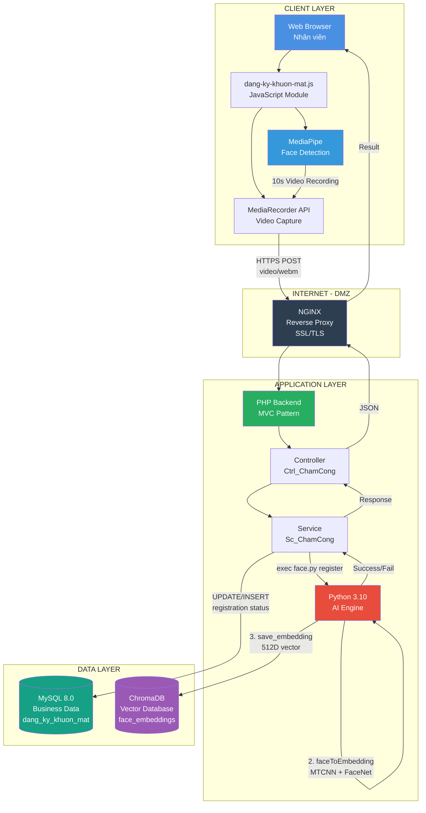
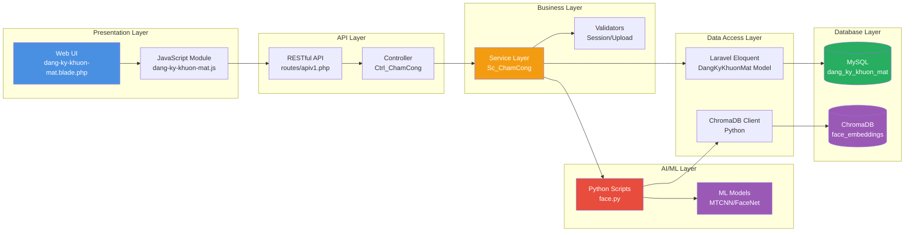
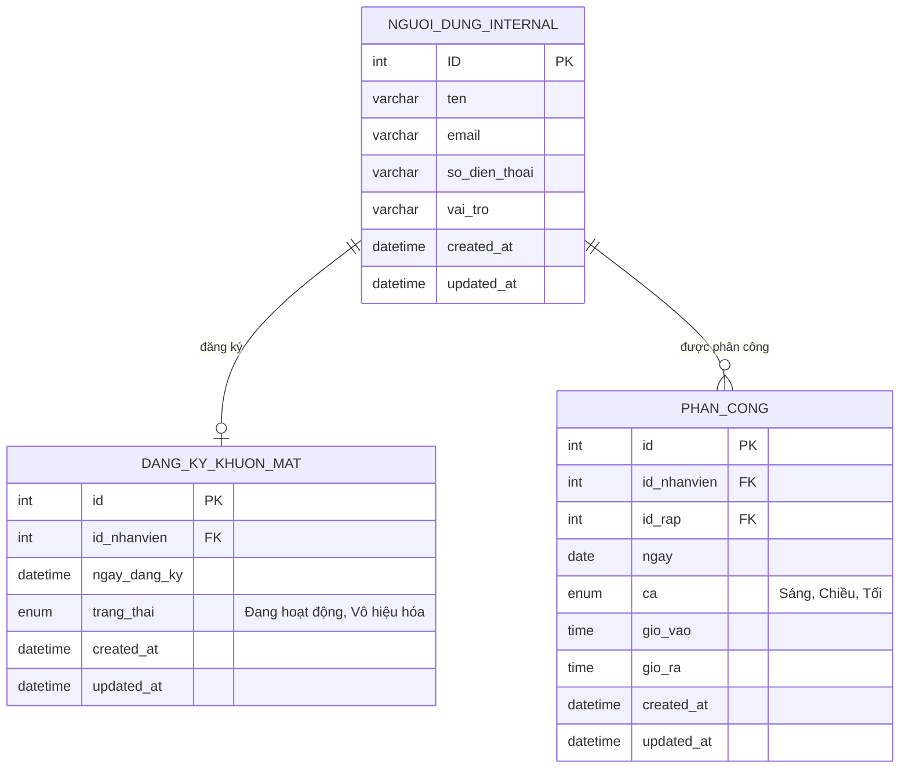
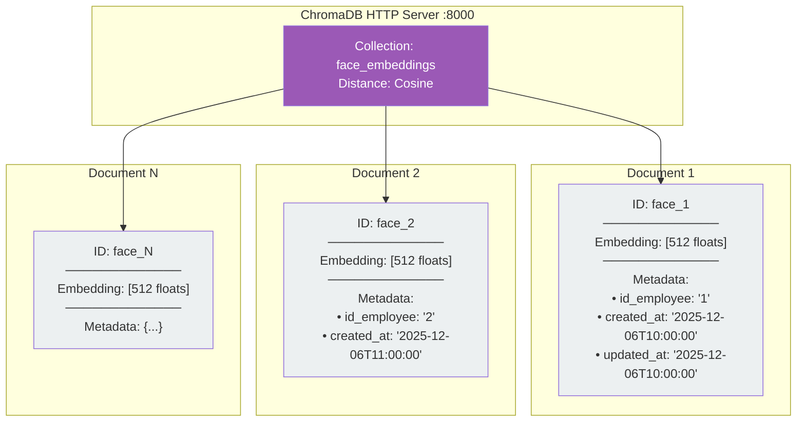
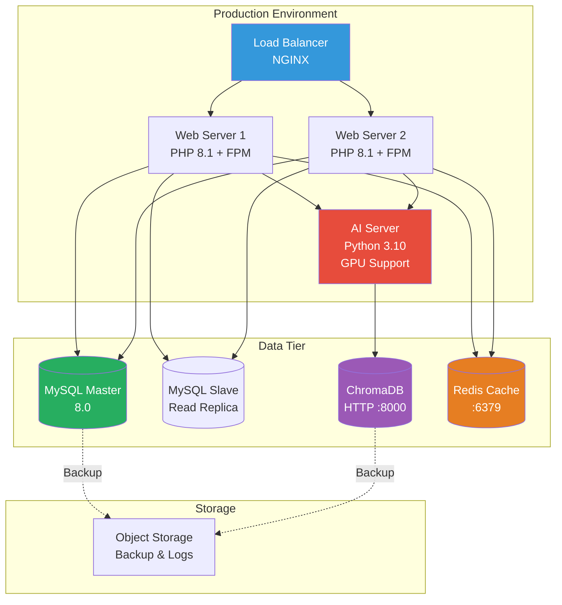

# TÀI LIỆU CHỨC NĂNG ĐĂNG KÝ KHUÔN MẶT

## 1. TỔNG QUAN

### 1.1. Mục đích
Chức năng đăng ký khuôn mặt cho phép nhân viên đăng ký thông tin khuôn mặt của mình vào hệ thống để sử dụng cho chấm công tự động bằng nhận diện khuôn mặt. Hệ thống sẽ thu thập video khuôn mặt, trích xuất đặc trưng (face embeddings), và lưu trữ vào cơ sở dữ liệu vector để sử dụng cho các lần xác thực sau.

### 1.2. Phạm vi
- Thu thập video khuôn mặt từ camera
- Kiểm tra chất lượng video và phát hiện khuôn mặt
- Trích xuất embedding từ video
- Lưu trữ embedding vào ChromaDB
- Cập nhật trạng thái đăng ký trong database

---

## 2. SƠ ĐỒ KIẾN TRÚC

### 2.1. Sơ đồ Tổng Quan



### 2.2. Luồng Xử Lý Chi Tiết

```mermaid
flowchart TD
    START([Nhân viên bấm nút<br/>Bắt đầu đăng ký]) --> INIT_CAM[BƯỚC 1: Khởi tạo Camera]
    
    INIT_CAM --> LOAD_MP[Load MediaPipe Model<br/>blaze_face_short_range.tflite]
    LOAD_MP --> REQ_CAM{Yêu cầu quyền<br/>truy cập Camera?}
    REQ_CAM -->|Từ chối| ERROR1[❌ Không có quyền camera]
    REQ_CAM -->|Cho phép| CONFIG_CAM[Cấu hình Camera<br/>1280x720 @ user-facing]
    
    CONFIG_CAM --> COUNTDOWN[BƯỚC 2: Đếm ngược<br/>3...2...1...]
    COUNTDOWN --> START_RECORD[BƯỚC 3: Bắt đầu ghi video<br/>10 giây]
    
    START_RECORD --> DETECT_LOOP{Loop detectLoop<br/>Real-time Detection}
    
    DETECT_LOOP --> DRAW_FRAME[Vẽ frame lên Canvas]
    DRAW_FRAME --> FACE_DETECT[MediaPipe detectForVideo]
    
    FACE_DETECT --> COUNT_FACES{Số khuôn mặt?}
    COUNT_FACES -->|0 faces| PAUSE1[⏸️ PAUSE ghi<br/>❗Không thấy khuôn mặt]
    COUNT_FACES -->|>1 faces| PAUSE2[⏸️ PAUSE ghi<br/>❗Nhiều khuôn mặt]
    COUNT_FACES -->|1 face| RESUME[▶️ RESUME ghi<br/>✓ Vẽ box xanh]
    
    PAUSE1 --> CHECK_TIME1{Còn thời gian?}
    PAUSE2 --> CHECK_TIME1
    RESUME --> DRAW_BOX[Vẽ bounding box + confidence]
    DRAW_BOX --> CHECK_TIME{Đủ 10 giây?}
    
    CHECK_TIME -->|Chưa| DETECT_LOOP
    CHECK_TIME -->|Đủ| STOP_RECORD[Dừng ghi - Hoàn tất]
    CHECK_TIME1 -->|Có| DETECT_LOOP
    CHECK_TIME1 -->|Hết| ERROR2[❌ Timeout - Video không đủ chất lượng]
    
    STOP_RECORD --> CREATE_BLOB[BƯỚC 4: Tạo Blob<br/>từ recordedChunks]
    CREATE_BLOB --> UPLOAD[Upload FormData<br/>POST /api/cham-cong/dang-ky-khuon-mat]
    
    UPLOAD --> PHP_CTRL[BƯỚC 5: Backend PHP<br/>Ctrl_ChamCong::xuLyDangKyKhuonMat]
    PHP_CTRL --> PHP_SVC[Sc_ChamCong::dangKyKhuonMat]
    PHP_SVC --> GET_SESSION[Lấy ID nhân viên từ session]
    GET_SESSION --> GET_VIDEO[Lấy video từ $_FILES]
    GET_VIDEO --> EXEC_PY[exec Python script<br/>face.py register]
    
    EXEC_PY --> PY_START[BƯỚC 6: Python AI Engine]
    PY_START --> PY_QUALITY[6.1 check_quality]
    
    PY_QUALITY --> CHK_BRIGHT[Check Brightness<br/>50-230]
    CHK_BRIGHT --> BRIGHT_OK{OK?}
    BRIGHT_OK -->|Không| ERROR3[❌ Độ sáng không phù hợp]
    BRIGHT_OK -->|OK| CHK_SHARP[Check Sharpness >= 25]
    
    CHK_SHARP --> SHARP_OK{OK?}
    SHARP_OK -->|Không| ERROR4[❌ Video mờ]
    SHARP_OK -->|OK| CHK_NOISE[Check Noise <= 100]
    
    CHK_NOISE --> NOISE_OK{OK?}
    NOISE_OK -->|Không| ERROR5[❌ Video nhiễu cao]
    NOISE_OK -->|OK| CHK_CONTRAST[Check Contrast >= 10]
    
    CHK_CONTRAST --> CONTRAST_OK{OK?}
    CONTRAST_OK -->|Không| ERROR6[❌ Tương phản thấp]
    CONTRAST_OK -->|OK| PY_EMBED[6.2 faceToEmbedding]
    
    PY_EMBED --> MTCNN[MTCNN Detect & Crop<br/>160x160px]
    MTCNN --> FACENET[InceptionResnetV1<br/>Extract 512D embedding]
    FACENET --> NORMALIZE[Normalize & Average<br/>từ tất cả frames]
    
    NORMALIZE --> PY_SAVE[6.3 save_embedding]
    PY_SAVE --> CHK_EXIST{Đã tồn tại<br/>trong ChromaDB?}
    
    CHK_EXIST -->|Có| UPDATE_CHROMA[BƯỚC 7: UPDATE embedding<br/>collection.update]
    CHK_EXIST -->|Không| ADD_CHROMA[BƯỚC 7: ADD embedding<br/>collection.add]
    
    UPDATE_CHROMA --> CHROMA_OK["✓ ChromaDB saved<br/>face_{id}"]
    ADD_CHROMA --> CHROMA_OK
    
    CHROMA_OK --> UPDATE_DB[BƯỚC 8: Cập nhật MySQL]
    UPDATE_DB --> DB_OP{Record<br/>tồn tại?}
    
    DB_OP -->|Có| UPDATE_SQL[UPDATE ngay_dang_ky]
    DB_OP -->|Không| INSERT_SQL[INSERT dang_ky_khuon_mat]
    
    UPDATE_SQL --> DB_OK[✓ MySQL updated]
    INSERT_SQL --> DB_OK
    
    DB_OK --> RETURN_SUCCESS[BƯỚC 9: Return Success]
    RETURN_SUCCESS --> SUCCESS([✅ Đăng ký thành công])
    
    style START fill:#4a90e2,color:#fff
    style SUCCESS fill:#27ae60,color:#fff
    style ERROR1 fill:#e74c3c,color:#fff
    style ERROR2 fill:#e74c3c,color:#fff
    style ERROR3 fill:#e74c3c,color:#fff
    style ERROR4 fill:#e74c3c,color:#fff
    style ERROR5 fill:#e74c3c,color:#fff
    style ERROR6 fill:#e74c3c,color:#fff
    style PY_QUALITY fill:#f39c12
    style PY_EMBED fill:#9b59b6
    style CHROMA_OK fill:#9b59b6
    style DB_OK fill:#16a085
```



---

## 3. CÔNG NGHỆ SỬ DỤNG

### 3.1. Frontend
| Công nghệ | Phiên bản | Mục đích |
|-----------|-----------|----------|
| **MediaPipe Tasks Vision** | 0.10.0 | Face Detection real-time trên browser |
| **MediaRecorder API** | Native Browser | Thu video từ camera |
| **Canvas API** | Native Browser | Vẽ bounding box và preview |
| **Fetch API** | Native Browser | Upload video lên server |

**Model MediaPipe:**
- Model: `blaze_face_short_range.tflite`
- Running Mode: VIDEO
- Min Detection Confidence: 0.5

### 3.2. Backend PHP
| Component | Technology |
|-----------|------------|
| **Framework** | Custom PHP MVC |
| **Route** | `/api/cham-cong/dang-ky-khuon-mat` (POST) |
| **Controller** | `Ctrl_ChamCong::xuLyDangKyKhuonMat()` |
| **Service** | `Sc_ChamCong::dangKyKhuonMat()` |
| **Database ORM** | Laravel Eloquent (Standalone) |

### 3.3. Python AI Engine
| Thư viện | Phiên bản | Mục đích |
|----------|-----------|----------|
| **facenet-pytorch** | Latest | Face detection (MTCNN) & Embedding (InceptionResnetV1) |
| **PyTorch** | Latest | Deep learning framework |
| **OpenCV (cv2)** | Latest | Video processing, image manipulation |
| **NumPy** | Latest | Array operations, embedding calculations |
| **ChromaDB** | Latest | Vector database client |

**Model FaceNet:**
- Pretrained: `vggface2`
- Architecture: InceptionResnetV1
- Output: 512-dimensional embedding
- Device: CUDA (nếu có) hoặc CPU

### 3.4. Database
| Database | Mục đích | Schema |
|----------|----------|--------|
| **ChromaDB** | Lưu trữ face embeddings (Vector DB) | `face_embeddings` collection |
| **MySQL/PostgreSQL** | Lưu metadata đăng ký | `dang_ky_khuon_mat` table |

**ChromaDB Configuration:**
- Host: localhost
- Port: 8000
- Distance Metric: Cosine Similarity
- Embedding Dimension: 512

---

## 4. CHI TIẾT TRIỂN KHAI

### 4.1. Frontend Implementation

**File:** `internal/js/dang-ky-khuon-mat.js`

#### 4.1.1. Khởi tạo MediaPipe
```javascript
const vision = await FilesetResolver.forVisionTasks(
  "https://cdn.jsdelivr.net/npm/@mediapipe/tasks-vision/wasm"
);

const faceDetector = await FaceDetector.createFromOptions(vision, {
  baseOptions: {
    modelAssetPath: "blaze_face_short_range.tflite"
  },
  runningMode: "VIDEO",
  minDetectionConfidence: 0.5
});
```

#### 4.1.2. Cấu hình Camera
- Target Resolution: **1280x720**
- Facing Mode: **user** (camera trước)
- Canvas Size: Match video resolution
- No DPR scaling (để đảm bảo tọa độ chính xác)

#### 4.1.3. Video Recording
```javascript
const options = { mimeType: 'video/webm;codecs=vp9' };
mediaRecorder = new MediaRecorder(stream, options);

// Thu thập 10 giây
const CAPTURE_DURATION = 10000; // ms
```

#### 4.1.4. Face Detection Loop
```javascript
async function detectLoop() {
  // 1. Vẽ frame lên canvas
  ctx.drawImage(video, 0, 0, overlay.width, overlay.height);
  
  // 2. Detect faces
  const detections = await faceDetector.detectForVideo(video, performance.now());
  
  // 3. Kiểm tra số lượng khuôn mặt
  if (detections.length === 1) {
    // OK: Tiếp tục ghi, vẽ box màu xanh
    pausedForNoFace = false;
    mediaRecorder.resume();
  } else {
    // PAUSE: Không có hoặc nhiều hơn 1 mặt
    pausedForNoFace = true;
    mediaRecorder.pause();
  }
  
  // 4. Vẽ bounding boxes
  drawBoundingBoxes(detections);
  
  // 5. Loop
  requestAnimationFrame(detectLoop);
}
```

#### 4.1.5. Upload Video
```javascript
const blob = new Blob(recordedChunks, { type: 'video/webm' });
const formData = new FormData();
formData.append('video', blob, 'video.webm');

const response = await fetch('/api/cham-cong/dang-ky-khuon-mat', {
  method: 'POST',
  body: formData
});
```

### 4.2. Backend PHP Implementation

**File:** `src/Services/Sc_ChamCong.php`

#### 4.2.1. Xử lý Upload
```php
public function dangKyKhuonMat()
{
    // 1. Lấy thông tin
    $idNhanVien = $_SESSION['UserInternal']['ID'];
    $videoPath = $_FILES['video']['tmp_name'];
    
    // 2. Chuẩn bị Python command
    $envPython = $_ENV['PYTHON_PATH'] ?? 'python3';
    $filePython = __DIR__ . '/../../bin/python/face.py';
    $fileLog = __DIR__ . '/../../cache/log/face_register.log';
    
    $command = escapeshellcmd("$envPython $filePython $videoPath $idNhanVien register");
    
    // 3. Thực thi
    exec("$command 2>> $fileLog", $output, $returnVar);
    
    // 4. Kiểm tra kết quả
    $result = implode("\n", $output);
    if (strpos($result, 'Face registration SUCCESSFUL') === false) {
        throw new Exception('Đăng ký thất bại');
    }
    
    // 5. Cập nhật database
    DangKyKhuonMat::updateOrCreate(
        ['id_nhanvien' => $idNhanVien],
        [
            'ngay_dang_ky' => now(),
            'trang_thai' => 'Đang hoạt động'
        ]
    );
}
```

### 4.3. Python AI Implementation

**File:** `bin/python/face.py`

#### 4.3.1. Kiểm tra Chất lượng Video
```python
def check_quality(video_path):
    """
    Kiểm tra 10 frames đầu
    Tính metrics: brightness, sharpness, noise, contrast
    """
    # Ngưỡng
    BRIGHTNESS_MIN = 50
    BRIGHTNESS_MAX = 230
    SHARPNESS_MIN = 25
    NOISE_MAX = 100
    CONTRAST_MIN = 10
    
    # Tính average metrics từ 10 frames
    # Return True nếu đạt yêu cầu
```

#### 4.3.2. Trích xuất Embedding
```python
def faceToEmbedding(video_path, sample_rate=5, resize_width=960):
    """
    1. MTCNN: Detect & crop face (160x160)
    2. InceptionResnetV1: Extract embedding (512D)
    3. Average & normalize
    """
    # Load models
    mtcnn = MTCNN(image_size=160, margin=0, device=device)
    model = InceptionResnetV1(pretrained='vggface2').eval().to(device)
    
    embeddings = []
    
    # Process video
    while True:
        ret, frame = cap.read()
        if not ret: break
        
        # Sample every 5 frames
        if frame_id % sample_rate != 0: continue
        
        # Detect face
        face_tensor = mtcnn(frame_rgb)
        if face_tensor is None: continue
        
        # Extract embedding
        with torch.no_grad():
            emb_t = model(face_tensor)
        
        # Normalize
        emb_np = emb_t.cpu().numpy()
        emb_np = emb_np / np.linalg.norm(emb_np)
        
        embeddings.append(emb_np[0])
    
    # Average all embeddings
    emb_avg = np.mean(embeddings, axis=0)
    emb_avg = emb_avg / norm(emb_avg)
    
    return emb_avg  # Shape: (512,)
```

#### 4.3.3. Lưu Embedding vào ChromaDB
```python
def save_embedding(embedding, id_employee):
    """
    Upsert embedding vào ChromaDB
    """
    client = chromadb.HttpClient(host="localhost", port=8000)
    collection = client.get_or_create_collection(
        name="face_embeddings",
        metadata={"hnsw:space": "cosine"}
    )
    
    target_id = f"face_{id_employee}"
    emb_list = embedding.tolist()
    
    # Check existing
    existing = collection.get(ids=[target_id])
    
    metadata = {
        "id_employee": str(id_employee),
        "updated_at": datetime.now().isoformat()
    }
    
    if existing and existing.get("ids"):
        # Update
        collection.update(
            ids=[target_id],
            embeddings=[emb_list],
            metadatas=[metadata]
        )
    else:
        # Add new
        metadata["created_at"] = datetime.now().isoformat()
        collection.add(
            ids=[target_id],
            embeddings=[emb_list],
            metadatas=[metadata]
        )
```

#### 4.3.4. Main Flow
```python
def register_face(video_path, id_employee):
    # 1. Kiểm tra chất lượng
    if not check_quality(video_path):
        print("✗ Face registration FAILED (low quality)")
        return
    
    # 2. Trích xuất embedding
    embedding = faceToEmbedding(video_path)
    if embedding is None:
        print("✗ Face registration FAILED (no embedding)")
        return
    
    # 3. Lưu embedding
    success = save_embedding(embedding, id_employee)
    if success:
        print("✓ Face registration SUCCESSFUL")
    else:
        print("✗ Face registration FAILED (save error)")
```

---

## 5. NGƯỠNG VÀ THAM SỐ

### 5.1. Tham số Chất lượng Video
| Metric | Min | Max | Ý nghĩa |
|--------|-----|-----|---------|
| **Brightness** | 50 | 230 | Độ sáng trung bình (0-255) |
| **Sharpness** | 25 | - | Variance of Laplacian (độ sắc nét) |
| **Noise** | - | 100 | Độ lệch chuẩn (nhiễu) |
| **Contrast** | 10 | - | RMS contrast |

### 5.2. Tham số Face Detection
| Parameter | Value | Ý nghĩa |
|-----------|-------|---------|
| **minDetectionConfidence** | 0.5 | Ngưỡng confidence tối thiểu |
| **Running Mode** | VIDEO | Chế độ xử lý video |
| **Model** | blaze_face_short_range | Model tối ưu cho khoảng cách gần |

### 5.3. Tham số Face Embedding
| Parameter | Value | Ý nghĩa |
|-----------|-------|---------|
| **Image Size** | 160x160 | Kích thước input cho MTCNN |
| **Sample Rate** | 5 | Lấy mẫu mỗi 5 frames |
| **Resize Width** | 960px | Resize frame trước khi xử lý |
| **Embedding Dimension** | 512 | Số chiều của vector embedding |
| **Min Face Size** | 20px | Kích thước khuôn mặt tối thiểu |

### 5.4. Tham số ChromaDB
| Parameter | Value | Ý nghĩa |
|-----------|-------|---------|
| **Distance Metric** | Cosine | Độ đo khoảng cách |
| **Similarity Threshold** | 0.6 | Ngưỡng xác thực (0.5-0.7) |
| **Collection Name** | face_embeddings | Tên collection |

---

## 6. XỬ LÝ LỖI

### 6.1. Lỗi Frontend
| Lỗi | Xử lý |
|-----|-------|
| **Không truy cập được camera** | Hiển thị thông báo yêu cầu cấp quyền |
| **Không phát hiện khuôn mặt** | Pause ghi, yêu cầu quay lại khung hình |
| **Nhiều hơn 1 khuôn mặt** | Pause ghi, yêu cầu chỉ 1 người trong khung |
| **Upload thất bại** | Hiển thị lỗi, cho phép thử lại |

### 6.2. Lỗi Backend
| Lỗi | Xử lý |
|-----|-------|
| **Thiếu session nhân viên** | Return error: "Không xác định nhân viên" |
| **Thiếu file video** | Return error: "Thiếu file video tải lên" |
| **Python script lỗi** | Log chi tiết, return: "Xem log để biết thêm" |
| **Kết quả không thành công** | Parse error từ Python, return error cụ thể |

### 6.3. Lỗi Python AI
| Lỗi | Message | Nguyên nhân |
|-----|---------|------------|
| **Low quality** | "Face registration FAILED (low quality)" | Video không đạt ngưỡng chất lượng |
| **No embedding** | "Face registration FAILED (no embedding)" | Không detect được khuôn mặt |
| **Save error** | "Face registration FAILED (save error)" | Lỗi khi lưu vào ChromaDB |
| **File not found** | "File not found" | Đường dẫn video không tồn tại |

### 6.4. Logging
```
Log file: cache/log/face_register.log

Format:
[Timestamp] Step: Description
- Brightness, Sharpness, Noise, Contrast metrics
- Number of embeddings collected
- Success/Error messages
```

---

## 7. BẢO MẬT VÀ PRIVACY

### 7.1. Bảo mật Dữ liệu
- ✅ Video chỉ lưu tạm trong `$_FILES['tmp_name']`
- ✅ Video được xóa sau khi xử lý xong
- ✅ Chỉ lưu embedding (512D vector), không lưu ảnh/video gốc
- ✅ ChromaDB chạy local (localhost:8000)
- ✅ Không gửi dữ liệu ra ngoài hệ thống

### 7.2. Phân quyền
- ✅ Yêu cầu đăng nhập (session)
- ✅ Chỉ nhân viên vai trò "Nhân viên" trở lên
- ✅ Mỗi nhân viên chỉ đăng ký cho chính mình

### 7.3. GDPR Compliance
- ✅ Dữ liệu sinh trắc học được mã hóa thành embedding
- ✅ Không lưu trữ hình ảnh khuôn mặt gốc
- ✅ Có thể xóa embedding khi nhân viên yêu cầu

---

## 8. PERFORMANCE

### 8.1. Thời gian xử lý
| Bước | Thời gian | Ghi chú |
|------|-----------|---------|
| **Thu video** | 10s | Cố định |
| **Upload** | 1-3s | Tùy kích thước video & mạng |
| **check_quality()** | 0.5-1s | 10 frames |
| **faceToEmbedding()** | 5-15s | Tùy số frame & hardware |
| **save_embedding()** | <1s | ChromaDB local |
| **Tổng** | ~15-30s | End-to-end |

### 8.2. Yêu cầu Hardware
| Component | Minimum | Recommended |
|-----------|---------|-------------|
| **CPU** | 2 cores | 4+ cores |
| **RAM** | 4GB | 8GB+ |
| **GPU** | Không bắt buộc | CUDA-enabled (tăng tốc 5-10x) |
| **Disk** | 2GB | SSD |

### 8.3. Tối ưu hóa
- ✅ Sample rate: 5 (chỉ xử lý mỗi 5 frames)
- ✅ Resize video: width=960px (giảm computation)
- ✅ ChromaDB: Local HTTP server (fast)
- ✅ MediaPipe: WebAssembly (chạy trên browser)

---

## 9. TESTING

### 9.1. Test Cases
| ID | Scenario | Expected Result |
|----|----------|-----------------|
| **TC01** | Đăng ký thành công với video chất lượng tốt | Lưu embedding, cập nhật DB, return success |
| **TC02** | Video quá tối (brightness < 50) | Return error: "low quality" |
| **TC03** | Video quá sáng (brightness > 230) | Return error: "low quality" |
| **TC04** | Video mờ (sharpness < 25) | Return error: "low quality" |
| **TC05** | Không phát hiện khuôn mặt | Pause ghi, yêu cầu quay lại |
| **TC06** | Nhiều hơn 1 khuôn mặt | Pause ghi, hiển thị warning |
| **TC07** | Đăng ký lại (update) | Update embedding cũ, không tạo mới |
| **TC08** | Không có quyền camera | Hiển thị lỗi permission |

### 9.2. Manual Testing
```bash
# Test Python script trực tiếp
python bin/python/face.py /path/to/video.webm 123 register

# Check ChromaDB
curl http://localhost:8000/api/v1/collections/face_embeddings

# Check log
tail -f cache/log/face_register.log
```

---

## 10. DEPLOYMENT

### 10.1. Requirements
```bash
# Python packages
pip install facenet-pytorch torch opencv-python numpy chromadb

# ChromaDB Server
docker run -p 8000:8000 chromadb/chroma

# hoặc
chroma run --path /path/to/data --port 8000
```

### 10.2. Environment Variables
```.env
PYTHON_PATH=/path/to/python3
# hoặc sử dụng virtual environment
PYTHON_PATH=/var/www/epiccinema.code/venv/bin/python
```

### 10.3. Permissions
```bash
# Log directory phải writable
chmod 755 cache/log/
chmod 644 cache/log/face_register.log

# Python script phải executable
chmod +x bin/python/face.py
```

---

## 11. MAINTENANCE

### 11.1. Monitoring
- 📊 Monitor `cache/log/face_register.log` cho errors
- 📊 Check ChromaDB collection size
- 📊 Monitor thời gian xử lý trung bình

### 11.2. Backup
```bash
# Backup ChromaDB
chromadb-cli export --path /path/to/backup

# Backup database table
mysqldump -u user -p database dang_ky_khuon_mat > backup.sql
```

### 11.3. Cleanup
```bash
# Xóa log cũ (>30 ngày)
find cache/log/ -name "*.log" -mtime +30 -delete

# Xóa embeddings của nhân viên đã nghỉ việc
python bin/python/face.py cleanup
```

---

## 12. ROADMAP

### 12.1. Cải tiến trong tương lai
- [ ] Thêm liveness detection (chống giả mạo ảnh)
- [ ] Hỗ trợ multi-face registration (nhiều góc độ)
- [ ] Tích hợp 3D face mapping
- [ ] Nén embedding (512D → 256D) để tiết kiệm storage
- [ ] Real-time quality feedback khi đang quay
- [ ] Progressive Web App (PWA) cho mobile

### 12.2. Known Issues
- ⚠️ Video codec vp9 không hỗ trợ trên một số browser cũ
- ⚠️ MTCNN có thể chậm trên CPU yếu
- ⚠️ Cần ánh sáng tốt để đạt chất lượng

---

## 13. KIẾN TRÚC PHÂN TẦNG (LAYERED ARCHITECTURE)



---

## 14. DATABASE SCHEMA

### 14.1. MySQL Schema (Entity Relationship)



### 14.2. ChromaDB Collection Structure



---

## 15. DEPLOYMENT DIAGRAM



---

## 16. REFERENCES

### 13.1. Documentation
- MediaPipe Tasks Vision: https://developers.google.com/mediapipe/solutions/vision/face_detector
- FaceNet PyTorch: https://github.com/timesler/facenet-pytorch
- ChromaDB: https://docs.trychroma.com/

### 13.2. Papers
- FaceNet: A Unified Embedding for Face Recognition and Clustering (Schroff et al., 2015)
- Joint Face Detection and Alignment using Multi-task Cascaded Convolutional Networks (Zhang et al., 2016)

---

**Document Version:** 1.0  
**Last Updated:** December 7, 2025  
**Author:** Development Team  
**Status:** Active
